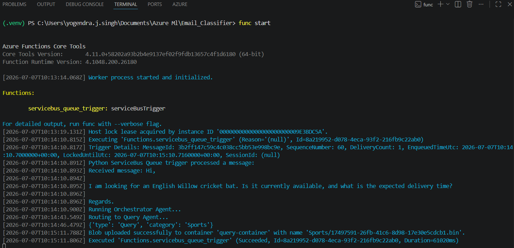

# Email Classification using Azure AI Foundry, Microsoft Agentic Framework, Azure Functions & Azure Blob Storage

## Overview

This project implements an end-to-end intelligent email classification system using Microsoft Azure services and Azure AI Foundry Agents. The system receives incoming emails, classifies them using a multi-agent architecture, and stores them in Azure Blob Storage based on their type and category.

The objective of this project was to gain hands-on experience with Azure cloud services, event-driven architectures, Azure AI Foundry, and the Microsoft Agentic Framework (MAF) while building a real-world AI-powered workflow.

---

# Project Workflow

The complete processing pipeline is shown below:

```
Postman
   │
   ▼
Azure Service Bus Queue
   │
   ▼
Azure Function (Queue Trigger)
   │
   ▼
Azure AI Foundry Agent Workflow
   │
   ▼
Orchestrator Agent
   │
   ├───────────────┐
   │               │
   ▼               ▼
Query Agent   Complaint Agent
   │               │
   └───────┬───────┘
           ▼
Classification Result
           │
           ▼
Azure Blob Storage
```

---

# Technologies Used

* Python
* Azure Functions
* Azure Service Bus
* Azure Blob Storage
* Azure AI Foundry
* Microsoft Agentic Framework (MAF)
* Azure Identity
* Azure AI Projects SDK
* Postman

---

# Project Architecture

The application follows an event-driven architecture.

1. A user submits an email through Postman.
2. The email is pushed to an Azure Service Bus Queue.
3. The Service Bus Queue automatically triggers an Azure Function.
4. The Azure Function reads the email message.
5. The Azure Function calls the Agent Workflow.
6. The Orchestrator Agent determines whether the message is a Query or a Complaint.
7. Depending on the result:

   * Query messages are routed to the Query Agent.
   * Complaint messages are routed to the Complaint Agent.
8. The selected agent classifies the email into one of the supported categories.
9. The Azure Function uploads the original email to Azure Blob Storage inside the correct container and virtual folder.

---

# Agent Design

## Orchestrator Agent

The Orchestrator Agent is responsible for high-level classification.

Its only responsibility is to determine whether an incoming email is a:

* Query
* Complaint

## Query Agent

The Query Agent processes emails already identified as queries.

It classifies them into one of the supported business categories.

## Complaint Agent

The Complaint Agent processes emails already identified as complaints.

It categorizes the complaint into the appropriate business category.


# Supported Categories

The system currently supports the following categories:

* Electronics
* Clothes
* Sports
* Accessories
* News
* Cosmetics
* Furniture
* General

These categories can easily be extended by updating the agent instructions.

---

# Blob Storage Organization

Emails are stored inside different containers based on their type.

## Query Container

```
query-container/
    electronics/
    clothes/
    sports/
    accessories/
    news/
    cosmetics/
    furniture/
    general/
```

## Complaint Container

```
complaint-container/
    electronics/
    clothes/
    sports/
    accessories/
    news/
    cosmetics/
    furniture/
    general/
```

Each uploaded email is stored using a unique UUID to avoid filename conflicts.

Example:

```
complaint-container/
    electronics/
        8e28d5d8-acde-4e0d-9bfa-acde7fd72d1c.json
```

---

# Key Features

* End-to-end event-driven architecture
* Azure Service Bus integration
* Azure Function Queue Trigger
* Azure AI Foundry Agent integration
* Microsoft Agentic Framework workflow
* Multi-agent routing
* Automatic email classification
* Structured JSON output
* Azure Blob Storage integration
* Category-based storage organization
* Modular Python codebase

---

# Project Structure

```
Email_Classifier/

│
├── function_app.py
├── agents.py
├── requirements.txt
├── host.json
├── local.settings.json
├── .env
└── README.md
```

---
## Outputs



# My Experience

* Started by creating an Azure Service Bus Queue and tested sending email messages from Postman.
* Created an Azure Function with a Service Bus Queue Trigger to read messages from the queue.
* Connected the Azure Function with Azure Blob Storage and tested uploading messages successfully.
* Faced some issues while creating and hosting agents through code, so created the agents directly in the Azure AI Foundry portal.
* Created three agents in Azure AI Foundry: Orchestrator Agent, Query Agent, and Complaint Agent.
* Connected the Foundry agents with my Python application using Azure Identity and the Azure AI Projects SDK.
* Built the workflow in `agents.py` where the Orchestrator Agent decides whether the message is a Query or a Complaint and then calls the correct agent.
* Connected the agent response back to the Azure Function and used it to store the email in the correct Blob Storage container and folder.
* Used category-based folders inside Blob Storage to organize the emails.
* Tested the complete flow from Postman → Service Bus → Azure Function → AI Agents → Blob Storage.
* Improved the workflow by creating the AI Project client only once instead of creating it every time.
* Reduced the response time by removing extra API calls and making the workflow more efficient.
* Updated and fine-tuned the agent prompts to get better and more accurate classifications.
* Finally completed a working end-to-end email classification system using Azure AI Foundry, Azure Functions, Azure Service Bus, and Azure Blob Storage.

